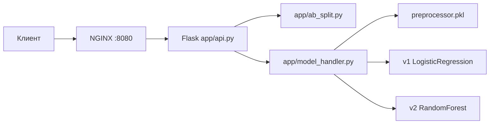
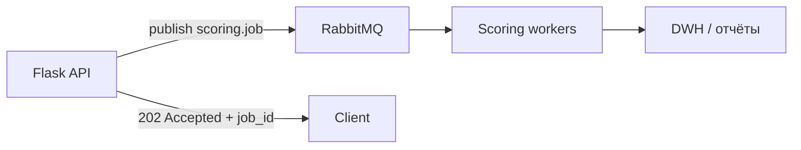

# Архитектура сервиса прогнозирования дефолта

Документ описывает реализацию репозитория `credit-card-ml-service` и рекомендации для production-like эксплуатации.
Реализованный ML-сервис предоставляет REST API для бинарной классификации: прогноз дефолта по кредитной карте в следующем месяце (`default.payment.next.month`).

Дан датасет - [Default of Credit Card Clients](https://archive.ics.uci.edu/ml/datasets/default+of+credit+card+clients) (UCI), файл `dataset/UCI_Credit_Card.csv`. Для предсказания сделаны две модели согласно заданию - `v1` (контроль), `v2` (тест). Подробности в [ab_test_plan.md](AB_TEST_PLAN.md)

Флоу данныих и запросов -


Модели и препроцессор загружаются один раз при старте процесса (`joblib.load`), инференс in-memory. Предоставленные уже обученные модели и препропроцессор, а также скрипт для их тренировки и создания перепроцессора (train_model.py) и ноутбук(просто потому что сначала сделал в ноутбуке)
Препроцессор принимает в себя список колонок из `features.py`, а именно 23 исходных поля, после `transform()` получаем расширенный вектор (~70 признаков) для sklearn-моделей.

| Тип признаков | Колонки | Преобразование |
|---------------|---------|----------------|
| Категориальные | `SEX`, `EDUCATION`, `MARRIAGE`, `PAY_0` … `PAY_6` | `OneHotEncoder` |
| Числовые | `LIMIT_BAL`, `AGE`, `BILL_AMT*`, `PAY_AMT*` | `StandardScaler` |

### API

| Метод | Путь | Ответ |
|-------|------|-------|
| `GET` | `/health` | `{"status": "healthy"}` |
| `POST` | `/predict` | прогноз + метаданные A/B |

Примеры [README.md](../README.md), [demo/api_examples.sh](demo/api_examples.sh).

## Ответы на вопросы задания

### Monolith Vs Microservice
В проекте выбран монолит: API, A/B-роутинг, загрузка моделей и инференс в одном Python-процессе. 
Ну просто ненужен микросервис для такой маленькой задачи. А если серьезно, то у нас есть всего лишь одна предметная область, нагрузка предполагается 1 rps, `v1` и `v2` уже в RAM - отдельный model-service не даёт выигрыша, ну и у меня просто нет столько кофе делать их этого микросервис.

Но если нужно независимое масштабирование CPU/GPU-инференса, горизонтальное расширение сервисной группировки, частые релизы моделей без перезапуска API, несколько продуктовых моделей и команд, жёсткие SLO по latency при высоком RPS и ответственность деньгами за технические провалы - то тогда нужно будет создавать микросервисную архитектуру с геокешированием и резервирование, поднимать swarm для оркестрации, елк для сбора и анализа логов, словом - делать вид что все серьезно.
А если делать вид что все серьезно - то 1 rps маловато будет, нагрузка в банках может достигать 100000 rps. И тут пригодится брокер. Ниже типичный сценарий при росте нагрузки в банке.



Пример топологии: exchange `scoring.requests` → routing key `credit.default` → queue `scoring.credit` → N consumers с загрузкой тех же `.pkl`.

| Сценарий | Зачем брокер |
|----------|----------------|
| Ночной батч-скоринг портфеля | API не блокируется, workers масштабируются горизонтально |
| Пики заявок | Очередь сглаживает burst, защита от перегрузки |
| Аудит и A/B | Consumer пишет в хранилище: `customer_id`, `model_version`, `probability`, `ab_group` |
| Интеграция | Другие системы банка публикуют задачи в общий exchange |

Для текущего A/B не требуются микросервис: сплит - выбор ветки в `model_handler`, а не отдельный деплой.

### Логирование и мониторинг

Каждое обращение к API - **одна строка JSON** в stdout (`request_logging.py`).

| `event` | Когда |
|---------|--------|
| `health_check` | `GET /health` |
| `predict_success` | успешный `POST /predict` |
| `predict_error` | ошибка 400 |

Пример `predict_success`:

```json
{
  "timestamp": "2026-06-04T10:00:01+00:00",
  "event": "predict_success",
  "service": "credit-card-ml",
  "model_version": "v2",
  "ab_assigned": true,
  "ab_group": "B",
  "prediction": 1,
  "probability": 0.792104,
  "customer_id": "client-42"
}
```

Уровень логов: `LOG_LEVEL` (по умолчанию `INFO`). Образцы: [demo/sample_logs.jsonl](demo/sample_logs.jsonl).

### ELK

| Компонент | Роль |
|-----------|------|
| **Filebeat / Fluent Bit** | Сбор stdout контейнеров Kubernetes/Docker |
| **Logstash** | Парсинг JSON, обогащение полями окружения |
| **Elasticsearch** | Хранение и поиск |
| **Kibana** | Дашборды: RPS, p95 latency, доля `predict_error`, распределение `ab_group` |

Рекомендуемые алерты: рост 5xx/400, дисбаланс A/B (далеко от 50/50), падение rps, рост отказов.

## uWSGI и NGINX в production

| Компонент | Назначение |
|-----------|------------|
| **uWSGI / Gunicorn** | Production WSGI-сервер: несколько worker-процессов, graceful reload, таймауты |
| **NGINX** | Reverse proxy: TLS-терминация, балансировка между репликами, rate limiting, ограничение размера тела запроса |

**Почему не `flask run` / `app.run(debug=True)`:** встроенный сервер Flask не предназначен для production (однопоточность, безопасность).

```text
Клиент → NGINX :443 (TLS) → upstream → Gunicorn/uWSGI → Flask application
```

Пример запуска:

```bash
gunicorn -w 4 -b 0.0.0.0:5000 "app.api:app"
```

**В учебном проекте:** `docker-compose.yaml` поднимает NGINX на порту **8080** как reverse proxy к `ml-service:5000` - демонстрация роли NGINX без полного uWSGI-стека.

## ONNX (концепт оптимизации инференса)

Модели sklearn можно экспортировать в ONNX для ускорения через ONNX Runtime, OpenVINO, TensorRT.

```python
from skl2onnx import convert_sklearn
from skl2onnx.common.data_types import FloatTensorType

n_features = 70  # после OneHot + scale
initial_type = [("input", FloatTensorType([None, n_features]))]
onnx_model = convert_sklearn(fitted_model, initial_types=initial_type)
```

| Плюсы | Минусы |
|-------|--------|
| Быстрее инференс на CPU/GPU | Отдельный экспорт препроцессора (или единый Pipeline в ONNX) |
| Единый формат для разных языков | Версионирование opset, совместимость рантайма |

В текущем сервисе: **joblib** + sklearn - достаточно для учебного pipeline.

## MLOps: DVC и MLflow

K сожалению я не очень хорошо понимаю эту тематику, но после работы с открытыми источниками можно сказать о назначении инструментов

| Инструмент | Применение в проекте |
|------------|---------------------|
| **DVC** | Версионирование `UCI_Credit_Card.csv`, связь данных с git-коммитами, воспроизводимость `train_model.py` |
| **MLflow Tracking** | Журнал экспериментов: F1/Recall v1 vs v2, параметры RandomForest |
| **MLflow Model Registry** | Стадии `Staging` / `Production` для `credit-default/v1`, `v2` |

## Бизнес-метрики

Помимо F1 / Precision / Recall (детали в [ab_test_plan.md](AB_TEST_PLAN.md)):

1. Ожидаемые потери от пропущенных дефолтов `Loss_FN = FN × Avg_Default_Loss`
2. Доля одобренных заявок при фиксированном τ - сравнение `% approved` и default rate среди одобренных между v1 и v2

## A/B-тестирование в архитектуре

| Режим | Условие | Поведение |
|-------|---------|-----------|
| Локально | `AB_TEST_ENABLED=false` | без `model_version` → `v1` |
| Docker Compose | `AB_TEST_ENABLED=true` | детерминированный сплит по `customer_id`, 50/50 |
| Override | в JSON указан `model_version` | ручной выбор, `ab_assigned: false` |

Переменные окружения: `AB_TEST_ENABLED`, `AB_SPLIT_RATIO`, `AB_HASH_FIELD`.

Код: `app/ab_split.py`. Полный план эксперимента: [ab_test_plan.md](AB_TEST_PLAN.md).

## Контейнеризация и оркестрация

**Dockerfile:** Python 3.12-slim, `app/` + `models/`, `ENV PYTHONPATH=/app`, порт 5000, `python -m app.api`.

**Docker Compose:**

| Сервис | Роль |
|--------|------|
| `ml-service` | Flask + модели, env для A/B |
| `nginx` | Reverse proxy, http://localhost:8080 |

```bash
docker compose up --build
curl http://localhost:8080/health
```

## Структура репозитория

```text
credit-card-ml-service/
├── app/
│   ├── api.py
│   ├── model_handler.py
│   ├── ab_split.py
│   ├── preprocessing.py
│   ├── features.py
│   └── request_logging.py
├── models/
│   ├── train_model.py
│   └── *.pkl
├── dataset/
├── tests/
├── docs/
│   ├── ARCHITECTURE.md
│   ├── AB_TEST_PLAN.md
│   └── demo/
├── nginx/
├── Dockerfile
├── docker-compose.yaml
└── README.md
```
